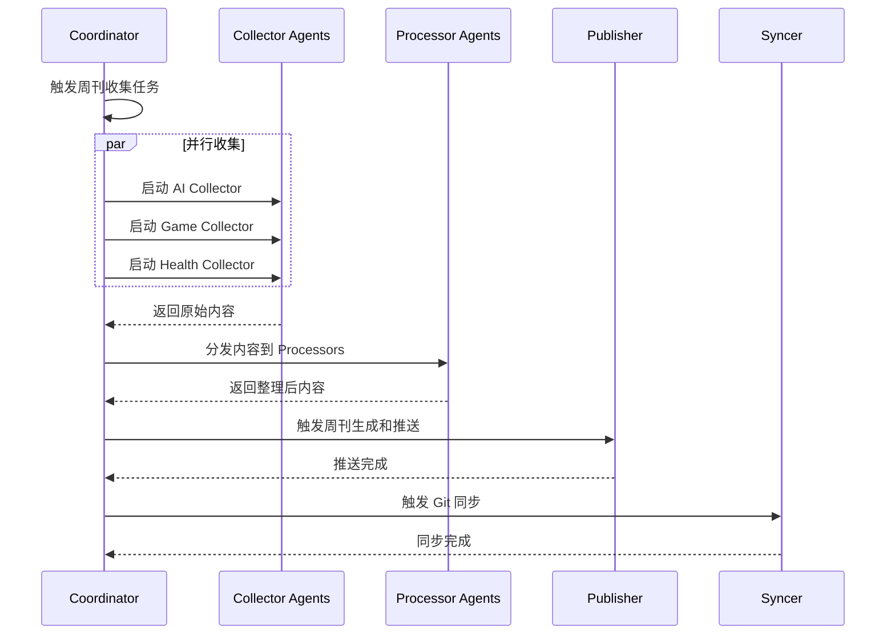
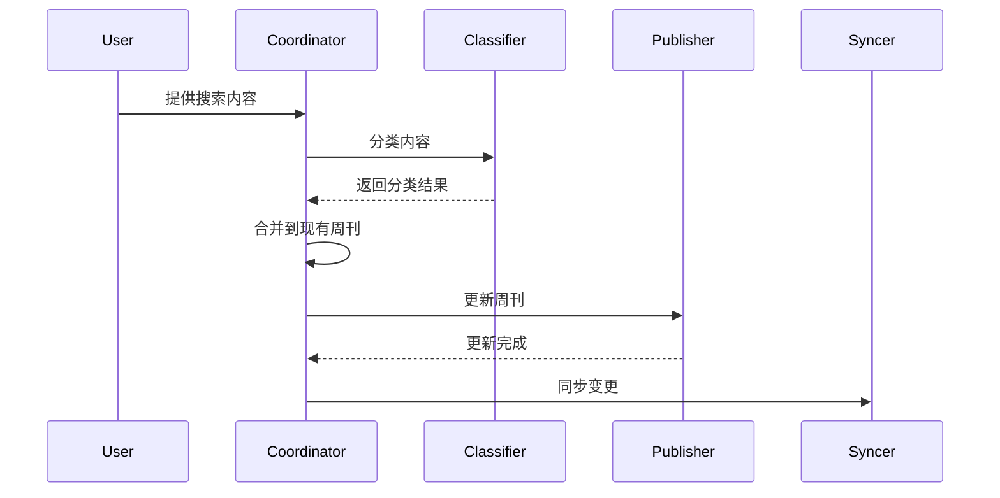

# 多 Agent 协作内容收集系统

## 架构概述

采用 **5 类 Agent 协作** 模式，实现内容收集、整理、推送、同步的全流程自动化。

```
┌─────────────────────────────────────────────────────────────┐
│                     Coordinator (协调器)                     │
│                    主控 Agent - 负责任务分发                  │
└─────────────┬───────────────────────────────────────────────┘
              │
    ┌─────────┼─────────┬─────────────┐
    │         │         │             │
    ▼         ▼         ▼             ▼
┌────────┐ ┌────────┐ ┌────────┐ ┌────────────┐
│AI收集器 │ │游戏收集器│ │健康收集器│ │  通用收集器  │
│Agent-1 │ │Agent-2 │ │Agent-3 │ │  (链接/其他) │
└────┬───┘ └────┬───┘ └────┬───┘ └──────┬─────┘
     │          │          │            │
     └──────────┴──────────┴────────────┘
                    │
                    ▼
┌───────────────────────────────────────────────┐
│              Content Processors                │
│         内容整理 Agents (可并行 N 个)           │
│  - 分类整理 Agent                              │
│  - 质量筛选 Agent                              │
│  - 摘要生成 Agent                              │
└───────────────────────┬───────────────────────┘
                        │
                        ▼
┌───────────────────────────────────────────────┐
│              Publisher Agent                   │
│              推送发布 Agent (单例)              │
│  - 生成周刊格式                                 │
│  - 推送到飞书知识库                             │
│  - 发送通知                                     │
└───────────────────────┬───────────────────────┘
                        │
                        ▼
┌───────────────────────────────────────────────┐
│               Syncer Agent                     │
│              同步 Agent (单例)                  │
│  - 同步本地缓存到 Git                          │
│  - 更新 Skill 文档                             │
│  - 备份操作日志                                │
└───────────────────────┬───────────────────────┘
                        │
                        ▼
┌───────────────────────────────────────────────┐
│              Maintainer Agent                  │
│            维护检查 Agent (单例)                │
│  - OpenClaw 流程维护                          │
│  - 系统健康检查                               │
│  - 定时任务调度                               │
└───────────────────────────────────────────────┘
```

---

## Agent 详细设计

### 1. Collector Agents (收集器) - 3个

#### Agent-1: AI Collector
- **职责**: 收集 AI 相关内容
- **输入**: 搜索关键词、时间范围
- **输出**: 原始内容列表 (JSON)
- **触发**: 每周五 18:00 自动 / 手动触发
- **工具**: web-search, web-fetch

```yaml
agent_id: collector-ai
name: "AI内容收集器"
kb: ai-latest-news
modules:
  - news      # 📰 行业资讯
  - tools     # 🛠️ 工具技巧
  - research  # 📚 深度研究
  - cases     # 💡 案例分享
search_queries:
  - "OpenAI Anthropic Google AI latest"
  - "AI人工智能 最新动态 GPT Claude"
```

#### Agent-2: Game Collector
- **职责**: 收集游戏开发内容
- **输入**: 搜索关键词、时间范围
- **输出**: 原始内容列表 (JSON)

```yaml
agent_id: collector-game
name: "游戏内容收集器"
kb: game-development
modules:
  - engine   # 🎮 游戏引擎
  - design   # 🎯 游戏设计
  - tech     # 💻 开发技术
  - art      # 🎨 美术资源
  - audio    # 🎵 音频音效
  - indie    # 🏆 独立游戏
search_queries:
  - "Unity Unreal game development"
  - "游戏开发 Unity 独立游戏"
```

#### Agent-3: Health Collector
- **职责**: 收集健康生活内容
- **输入**: 搜索关键词、时间范围
- **输出**: 原始内容列表 (JSON)

```yaml
agent_id: collector-health
name: "健康内容收集器"
kb: healthy-living
modules:
  - fitness   # 🏃 运动健身
  - diet      # 🥗 饮食营养
  - mental    # 😊 心理健康
  - sleep     # 💤 睡眠健康
  - medical   # 🏥 医疗资讯
  - tips      # ✨ 生活妙招
search_queries:
  - "健康 运动 饮食 生活妙招"
  - "fitness nutrition mental health"
```

### 2. Processor Agents (整理器) - N个并行

#### Agent-4: Classifier
- **职责**: 内容分类
- **输入**: 原始内容列表
- **输出**: 按模块分类的内容

```yaml
agent_id: processor-classifier
name: "内容分类器"
function: classify_content(title, content) -> module
rules:
  ai:
    news: ["发布", "融资", "OpenAI", "news"]
    tools: ["工具", "教程", "技巧", "Prompt"]
    research: ["论文", "原理", "分析", "研究"]
    cases: ["案例", "实践", "经验"]
  game:
    engine: ["Unity", "Unreal", "Godot", "引擎"]
    design: ["设计", "机制", "玩法"]
    # ...
```

#### Agent-5: Quality Filter
- **职责**: 质量筛选
- **输入**: 分类后的内容
- **输出**: 高质量内容列表 + 质量评分

```yaml
agent_id: processor-quality
name: "质量筛选器"
filters:
  min_confidence: 0.4    # 最低置信度
  high_quality: 0.8      # 高质量阈值
  authoritative_sources:  # 权威来源加分
    - "官方博客"
    - "知名媒体"
    - "学术论文"
```

#### Agent-6: Summarizer
- **职责**: 生成摘要和要点
- **输入**: 高质量内容
- **输出**: 带摘要的内容列表

```yaml
agent_id: processor-summarizer
name: "摘要生成器"
output:
  - title
  - summary      # 一句话摘要
  - key_points   # 3-5个要点
  - source
  - date
  - url
```

### 3. Publisher Agent (推送器) - 1个

#### Agent-7: Publisher
- **职责**: 生成周刊并推送到飞书
- **输入**: 整理后的内容
- **输出**: 飞书知识库周刊文档

```yaml
agent_id: publisher
name: "周刊推送器"
tasks:
  - generate_weekly_md     # 生成本地周刊
  - create_feishu_nodes    # 创建飞书层级节点
  - write_feishu_content   # 写入周刊内容
  - send_notification      # 发送完成通知
```

### 4. Syncer Agent (同步器) - 1个

#### Agent-8: Syncer
- **职责**: 同步本地缓存和 Skill 到 Git
- **输入**: 本地文件变更
- **输出**: Git commit

```yaml
agent_id: syncer
name: "Git同步器"
tasks:
  - add_files:      # git add
      - "memory/**/*.md"
      - "skills/**/*.md"
  - commit:         # git commit
      message_template: "content(weekly): update {kb} weekly {date}"
  - push:           # git push
      branch: main
```

### 5. Maintainer Agent (维护器) - 1个

#### Agent-9: Maintainer
- **职责**: OpenClaw 流程维护和系统健康检查
- **触发**: Heartbeat / Cron

```yaml
agent_id: maintainer
name: "系统维护器"
tasks:
  health_check:
    - check_gateway_status
    - check_disk_space
    - check_feishu_connection
  workflow_maintenance:
    - update_heartbeat_md
    - check_cron_jobs
    - verify_agent_status
  schedule:
    - heartbeat: "0 */4 * * *"    # 每4小时
    - weekly_collection: "0 18 * * 5"  # 每周五18:00
```

---

## 工作流程

### 主流程：周刊自动收集



### 辅助流程：用户添加内容



---

## 配置方式

### 1. 配置文件

`skills/content-collector/agents/config.yaml`:

```yaml
agents:
  collectors:
    - id: collector-ai
      kb: ai-latest-news
      schedule: "0 18 * * 5"
      
    - id: collector-game
      kb: game-development
      schedule: "0 18 * * 5"
      
    - id: collector-health
      kb: healthy-living
      schedule: "0 18 * * 5"
  
  processors:
    - id: processor-classifier
      parallel: true
      
    - id: processor-quality
      parallel: true
      
    - id: processor-summarizer
      parallel: true
  
  publisher:
    id: publisher
    single_instance: true
  
  syncer:
    id: syncer
    single_instance: true
  
  maintainer:
    id: maintainer
    schedule: "0 */4 * * *"
```

### 2. Agent 实现方式

由于当前环境 sub-agent 限制，采用 **模拟多 Agent 的脚本架构**：

```
skills/content-collector/
├── agents/
│   ├── __init__.py
│   ├── config.yaml          # Agent 配置
│   ├── coordinator.py        # 协调器 (主控)
│   ├── collectors/           # 收集器 Agents
│   │   ├── __init__.py
│   │   ├── base.py
│   │   ├── ai_collector.py
│   │   ├── game_collector.py
│   │   └── health_collector.py
│   ├── processors/           # 整理器 Agents
│   │   ├── __init__.py
│   │   ├── classifier.py
│   │   ├── quality_filter.py
│   │   └── summarizer.py
│   ├── publisher.py          # 推送器 Agent
│   ├── syncer.py             # 同步器 Agent
│   └── maintainer.py         # 维护器 Agent
├── scripts/
│   └── run_agents.py         # 启动脚本
└── SKILL.md
```

---

## 使用方式

### 启动完整流程

```bash
# 启动 Coordinator，自动分发任务到各 Agent
python skills/content-collector/agents/coordinator.py \
  --task weekly_collection \
  --week current
```

### 单独启动某个 Agent

```bash
# 单独收集 AI 内容
python skills/content-collector/agents/collectors/ai_collector.py --week current

# 单独分类内容
python skills/content-collector/agents/processors/classifier.py --input file.json

# 单独同步到 Git
python skills/content-collector/agents/syncer.py
```

### 用户添加内容

```bash
# 用户提供内容，Coordinator 负责合并
python skills/content-collector/agents/coordinator.py \
  --task add_content \
  --kb ai-latest-news \
  --file user_content.md \
  --merge
```

---

## 扩展设计

### 新增知识库

1. 添加 Collector Agent:
   ```python
   # agents/collectors/new_kb_collector.py
   class NewKBCollector(BaseCollector):
       kb_key = "new-kb"
       modules = ["module1", "module2"]
   ```

2. 更新配置:
   ```yaml
   collectors:
     - id: collector-new-kb
       kb: new-kb
   ```

### 新增 Processor

1. 添加 Processor Agent:
   ```python
   # agents/processors/new_processor.py
   class NewProcessor(BaseProcessor):
       def process(self, content):
           # 处理逻辑
           return processed_content
   ```

---

## 监控和日志

每个 Agent 独立记录日志:

```
logs/
├── coordinator.log
├── collector-ai.log
├── collector-game.log
├── collector-health.log
├── processor-classifier.log
├── publisher.log
├── syncer.log
└── maintainer.log
```

---

*多 Agent 协作内容收集系统 - 实现高效、可扩展的内容自动化管理*
